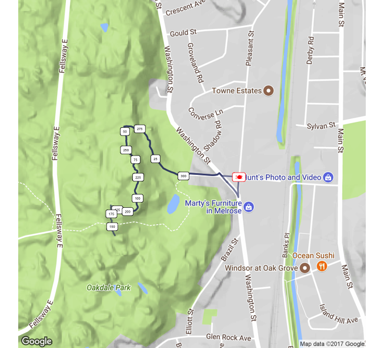

# Capstone Project - Running Routes with Reinforcement Learning
## Machine Learning Engineer Nanodegree
Frank Corrigan
October 2, 2017

## I. Definition

### Project Overview
Approximately 17 million individuals in the US (according to 2015 data from runningUSA.org) identify themselves as runners. These are people that have participated, at least once, in an organized running race. This cohort is continuously searching for recommendations on how to run faster, who to run with, and where to find more enjoyable runs. That final question is the topic of focus in this capstone project. A particularly common method of deciding where to run is to ask other runners. Recently, websites such as Strava or MapMyRun have made the answer to this question more shareable. Any runner can throw a GPS-enabled watch on their arm, go for a run, upload the data to their site of choice, and other runners and view what routes other runners are running most often. The most popular routes are regarded as the best routes to run. 

However, not every runner enjoys the same scenery or can take the time to commute to those best run locations. It would be advantageous if we could find the best or optimal run according to personal taste directly from where we are staying or living. Since time is finite and exploration of the options for running routes seems infinite, machine learning can assist in determining these optimal paths. The problem of considering which route to take is not unique to runners and running paths - optimal path finding problems exist and have been studied in depth in a variety of fields including naval ship ocean traversal, automobile navigation through road networks, logistics (recall the infamous traveling salesman problem), and even in a related activity, cycling. An optimal path, depending upon its application, could mean the shortest path, the most fuel efficient path, or the fastest path. Each of these fields lends information for how to think about determining the best running route from an individual's current location. 
Leigh M. Chinitz had a similar idea many years ago. In 2004, he registered a US patent on an algorithm that created closed loops for cyclers. The website that leverages this algorithm, RouteLoops.com, asks the user for a starting location and target mileage and creates a looped route the cycler (or walker) can follow. Additionally, there are some high level preferences you can select such as road selection type. This research is helpful in understanding a good method for creating loops from the same start and end location. However, the RouteLoops algorithm is explicit and doesn’t incorporate preferences such as “run past water” or “go past historical monuments.” RouteLoops.com also struggles with short distances since repeating at least part of the course may be mandatory. I should also note that MapMyRun.com also has a demo product that creates loops for runners, but in it’s current form (April 2017) it only works in Paris, France. You can upgrade to use it in other cities. 

On a personal note, I've been a competitive runner for many years through high school, college, and ever since. When I moved up to Melrose, MA -- 10 miles outside Boston -- a few months ago I was delighted and overwhelmed by the numerous options of trails I could explore. I do love exploration when I run, but as I worked through Udacity's Smartcab Reinforcement Learning project I began to realize that running a new trail system and finding the best loops is very similar to the q-learning algorithm I was creating to teach a car to drive. I wondered if my computer could help me find the best trails in a much timelier fashion than just running every day. From years of experience, I have good intuition for what constitutes a good trail or a good run. If I can map a reward system to attributes of the trail system, we can use simulation and reinforcement learning to determine the best routes even before lacing up our sneakers. 

* http://www.runningusa.org/statistics
* http://users.iems.northwestern.edu/~dolira/dolinskaya_dissertation.pdf 
* https://en.wikipedia.org/wiki/Travelling_salesman_problem 
* http://patft.uspto.gov/netacgi/nph-Parser?u=%2Fnetahtml%2Fsrchnum.htm&Sect1=PTO1&Sect2=HITOFF&p=1&r=1&l=50&f=G&d=PALL&s1=7162363.PN.&OS=PN/7162363&RS=PN/7162363 


### Problem Statement

The problem statement in it's simplest question form is "tell me the best (or optimal) running route from my current location." A runner wants to run the best runs as soon as possible, but it takes time to learn where they are and what your surroundings have to offer. Where are the trails or bike paths that will allow me to enjoy nature or avoid intersections and getting hit by cars? Where are the enormous uphills that I'd like to avoid (or attack) today? Are there historical structures or tourist attractions that I'd like to run past and see in this area? Is the neighborhood safe for me to run through? Are there restrooms or water fountains I can pass along the way? Each one of these questions, in total, is a piece of this problem.
A 10 mile run could have dozens of different split point decisions that need to be made. If a runner ran a trail system 1000 times, they'd be able to pinpoint the most rewarding runs given the characteristics of that area. However, 1000 runs could take several years! The goal is to speed up this learning process for each individual runner. Applying reinforcement learning to this problem will allow the runner to know the optimal decision at each split point in order to maximize the utility of a running loop based on a desired target mileage number. We can measure that by A) plotting on a map what the algorithm suggests as the best path and B) inspecting each decision at different points with knowledge of what lies ahead in that best path. If this works for me -- in the MIddlesex Fells Reservation -- it should work anywhere we can obtain map data for.

The optimal route -- for this particular solution -- will create a loop (start and end at same location) and maximize miles on "trails" (which can include hiking trails, running paths, or bike paths) rather than roads, include picturesque water views, and incorporate the highest number of historical or natural landmarks possible. It should be noted that a true loop is not required, although nice. A figure 8 is also desirable as is a loop where you “run to the reservoir, run around it, and run back the same way you came.” Balancing other variables will result in alternative solutions to this problem. For instance, if an individual is recovering from a hamstring injury they will want to avoid hills and as such minimize elevation gain to yield the optimal route. This implementation will focus on mileage on trails, aesthetically pleasing or educational surroundings.
The algorithm under development will include 2 user inputs. A starting location and a target mileage for the run. Simultaneously, we'll use a reinforcement learning algorithm to determine the best route for the target mileage. 

Ultimately, you'll have a policy table for each possible move that will still loop you from the same location and route your run through the best places the area has to offer (+trails, +views, +history). This entirely answers the question, if I'm at location X on this 5 mile run, which direction should I go next in order to maximize utility? We'll be able to look at the optimal policy the algorithm determines, look at the path and its contents on a map, and determine if the algorithm has learned what we would consider the best policy. 

A successful implementation will yield a running route that is within one-quarter mile of the target mileage for the run and will include the maximum number of waterfront paths and historic landmarks given the vicinity of the user's location. This may be challenging, if not impossible, in some cases. For example, the desired start location may be in Nebraska where there is only a single road in two directions for 10+ with no trails, no water, and no historic landmarks in the area. Since success in that instance would not be achievable, this implementation will narrow the geographic boundaries considered for training to a portion of Malden, Melrose, and Winchester, Massachusetts the majority of which is called the Middlesex Fells Reservation. A successful algorithm will have the ability to render the best (optimal) running route from most any location.


### Metrics

Until we have a computer-human feedback loop in place where the algorithm suggests a loop, the runner runs it, and they rate how awesome the route was we won’t have the perfect data to measure (and improve) the success of the algorithm. Instead, to start, we’ll consider 2 criteria for the success of the algorithm.

In the proposal statement for this project, I suggested the time taken to compute the optimal path should not exceed 30 seconds. To quote myself, “I don’t even want to wait more than 30 seconds for my Garmin (GPS watch) to find a satellite connection and most runners won’t want to wait more than a few seconds for a suggested run… they’ll just go.” After months of testing, this time limit seems foolish the way I originally envisioned. When considering the user (customer) we’ll have to take an alternative approach to calculating the optimal path at the time of use (perhaps another algorithm is needed to predict where a user will want to start/end their run from). In the dataset used for this project there are 15,000 nodes (15K decision points -- see visualization in Section: Analysis - Exploratory Visualization ). While the combinations for how those nodes can be connected on a loop is finite, it certainly exceeds our ability to simulate and learn optimal path policy in 30 seconds. In the results below, I’ve included the time it takes for our algorithm to converge based on a varying mileage parameter (as well as my understanding of convergence in this problem).

The second evaluation metric is the quality of the run. For this, I will use myself since I am familiar with the Fells (I live in Melrose, MA next to the Fells and have run there every day for the past year) and I will be able to give a subjective assessment of how good the loop is relative to other routes we know we could take. I will also test a start point where I grew up since I have run countless miles from that start location as well. Despite its unscientific nature, this will give a better assessment of the quality of the suggested run than anything else available.


## II. Analysis

### Data Exploration

The dataset for this project will come from OpenStreetMaps.org. This open source geospatial data can be downloaded in .OSM format, which is very similar to XML. Further, there are many good resources on how to extract and manipulate these files. The map for this project will include parts of Malden, Melrose, and Winchester, MA. which is primarily the Middlesex Fells Reservation area. Technically, the bounds include ```<bounds minlat="42.4251000" minlon="-71.1318000" maxlat="42.4702000" maxlon="-71.0699000"/>```. 

This data includes both nodes and ways. Nodes -- which include latitude and longitude coordinates -- identify points on a map and ways -- which include collections of nodes -- identify links between nodes. Nodes and ways are tagged with different types of identifiers. For example, a node may be tagged with v="traffic_signal" meaning there is a traffic light at those coordinates. Waypoints have significantly more tags. One very common tag is k="name" usually accompanied by a street name. The starting location for this project will be Stone Place in Melrose, MA - where I currently reside. Three other tags that will be leveraged to assign rewards to different ways are

1. "highway" equals "path" or "footpath" which will indicate that the way is a running path prefered over the road. 
2. "tourism" equals "alpine_hut", "wilderness_hut", or "viewpoint" which indicates either natural-setting shelter (usually in cool places) or a lookout where you can see something neat (in this case it will be a skyline view of Boston). This tag also includes "artwork" (it's always neat to run by a Banksy).
3. "historic" equals anything usually means something cool. Count it. 
4. "natural" equals anything. There are a variety of tags to tell us about the way here including "peak" (is it a mountain peak) and "water" or "spring" (does it go past a body of water).
The world is vast, and so is the data that represents it. This file is approximately 28MBs and contains 127,443 nodes. This contains a lot more than roads and paths; it also includes data points for building structures too. After filtering out only roads and paths (which would be ways available for running) using OSMFILTER the file is 5.6MB with only 24860 nodes. Still huge. I explain further attempts to scale down the data in Section: Methodology - Data Preprocessing.

This dataset is built by dozens of individual contributors. While the dataset used in this project is very well tagged -- lots of people hike this trail system -- some more remote areas may not have the same quality of data. A lack of tags will severely impact the quality of the results - garbage in, garbage out.

* http://www.openstreetmap.org 
* http://www.openstreetmap.org/#map=13/42.4530/-71.1269 *http://wiki.openstreetmap.org/wiki/Hiking 


### Exploratory Visualization

The map below shows the region where we are training our algorithm. Each black dot represents a data point (a node). The red dot is the starting location. Although the area is well tagged, you can see that some paths in the Fells are still “unchartered”. In the lower left hand corner you can see the white line trails that are not overlapped by black dots. 


The above map shows all nodes. This is too many nodes to iterate over as it makes convergence near impossible. In order to reduce the size of the dataset we can capture the same information by filtering to only intersections (decision points). The below map shows intersections only -- considerably less dots than the map above. 


### Algorithms and Techniques
This implementation builds a q-learning algorithm. Here is a screenshot from Wikipedia showing the basic algorithm:


That equation ultimately gives us a policy for what we should do at each node. Imagine you are at a specific point on a run. In order to decide where to go next you assess your environment -- where did I just come from, how much further do I want to go, what are my options and where will they take me relative to my start location -- and make a decision. However, there is one last component of that decision. You would want to know not only the immediate result of your decision but also how that decision impacts your future movements. This equation, updating the policy of a specific movement over many iterations, allows us to incorporate both immediate and future information at the same time. To make this more concrete, imagine you are at a crossroads and you have 2 options. Each of those options are x miles away from the start. Option 1 will eventually lead to a busy road with many traffic lights and lots of cars (not good). Option 2 will eventually lead to a beautiful waterfall with soft ground surrounded by pine trees (good). That’s future information. The iteration cycle will help the algorithm incorporate that future information into the decision it makes about the current movement and eventually guide us away from the road and to that waterfall.

Below defines the major parameters of the model. 

* _States & Rewards._ The reward of a state is determined by a few different variables interacting at the same time. A state describes where the runner is, where the runner was before they moved to their current position, and the duration (a binary variable telling if the running is halfway through the run or not). The foundation of the reward is the feature of the way -- is it on trail, does it have a nice scenic view, does it go past water, or does it go past a historic landmark. The tags in the data tell us this information. The reward is adjusted to further teach the algorithm how to run. First, if the duration is low (meaning the running is less than halfway through the run) and the runner moves to the further point from the start location (see Determining Distance below), the reward goes up. Similarly, if the duration is high and the runner moves to the closest point from the start location, the reward goes up. Second, if the runner goes backwards, they incur a large deduction. This is all learned by leveraging the geospatial component of our dataset. Although we don’t mind if we repeat part of the course, we certainly don’t want to turn around -- continuous, fluid, motion is always a goal for runners.
* _Determining Distance._ We use two distance calculations. First, we implement a simple trigonometric calculation (as the crow flies) to get a sense of where nodes are relative to the start location. Second, we implement a local routing service to inform the algorithm how far a specific node is from the start location. This second component helps us decide, of the next options I can take on my run, which one is closest and which one is furthest from where I started.
* _Alpha, Gamma, and Epsilon._ There are 3 parameters that manipulate how this algorithm learns. This environment is not deterministic -- meaning the reward structure changes from run to run depending upon the path selection -- and as such, we decay alpha 1.0 to 0.0 in the algorithm. This allows us to learn incrementally the information learned during a movement into our optimal policy. We use a gamma of 0.5 because the future matters just as much as the immediate movement. Finally epsilon, we decay this parameter over the length of the simulation which encourages the algorithm to explore a lot in the earlier stages but exploit the knowledge gained as it gets closer to the conclusion of the simulation. Without the decay, more frequently than not, you end up with “gaps” in the optimal policy -- it doesn’t know what to do at a certain location.


### Benchmark

Since no single source will serve as a benchmark of the output of this model, I will leverage two existing tools; RouteLoops.com and Strava.com. RouteLoops will show me how quickly the algorithm needs to perform. While it doesn’t have to be as fast as RouteLoops, it will have to be within “range” of the RouteLoop builder. RouteLoops can build random loops within seconds and this algorithm should perform similarly while providing a more personalized, optimal route. Additionally, we can compare quality of decisions the algorithm makes by observing decisions RouteLoop makes. Did we create a loop or was it an out and back? Was the loop a figure eight? Did our algorithm select more trail intensive loop than RouteLoops?
Second, Strava.com will show you the most competitive segments. Segments are not loops, they are pieces of loops. For a given area we can identify the most competitive segments (perhaps using the Strava API) and see if the ‘optimal’ running path runs along any of these segments. 


## III. Methodology

### Data Preprocessing

Fundamentally, the success of this project is attributable to data preprocessing. Without understanding and scaling down the right input dataset, the algorithm results would never be sufficient. 
Connecting the q-learning algorithm with the osm data is really about trying to parse the xml file into a useable format that the algorithm can consume. We needed a few items…

* _Neighbor nodes._ For every single node visited, we needed to know it’s relative position on the way (aka path aka route) so the algorithm could decide where it came from and where to go next. We wrote a function that takes a node as the input and returns its surrounding “neighbor” nodes. 
* _Geospatial coordinates._ Each node is assigned lat/lon coordinates. Each node is part of a way. In order to figure out the distance of a node from the last and future position, as well as its distance from the start location, we needed to pull out the coordinates. 
* _Obtaining Rewards._ For every single node visited, we needed the foundational reward. In the dataset, each way is comprised of a list of nodes and has a series of tags. For example, k=”highway” v=”footway” indicates that the way is a path for walking (not vehicles). The algorithm needed to know the reward for each

When you download map data from openstreetmap.org, you start with A LOT of information. Not all of this information is relevant for this project. The initial data file that was downloaded was 28MBs with 120K+ nodes. Not all of this is “runnable.” You are not going to run through a building, you are probably not going to run down a service street or driveway, and you don’t need to know the relationship between a street and a particular building. I needed to strip that away to make the algorithm work and work faster. So I used OsmFilter to discard a lot of unuseful information from the dataset. For the record, it took me months to realize this was the case and as a result I spend many hours trying to tweak the algorithm to unuseful data. The lesson here -- one that I already knew but needed to relearn -- is that you should really know your data before trying to build a model on it. This is the command I used in my terminal:

./osmfilter map --keep="highway= and name=" --drop="highway=service">streets_to_run.osm

This tells the tool to parse the file keeping only streets with a name and removing any street designated a service road (so I don’t end up running around parking lots all day). I document this process in the section below Section: Methodology - Implementation.

This brings the file from 28MBs with 120K+ nodes to 3.5MBs with 15K nodes (see the visual above to get a sense of what this means). While this is still big and requires a large amount of computation time it certainly helped yield reasonable results. 

This is a huge step, however, it’s not enough. Before running the data points through the algorithm I also removed all nodes that aren’t decisions points -- intersections. You can see this visually in the Exploratory Visualization section above and I describe how I do it in the Implementation section below.


### Implementation

In order to complete this project, 5 main steps were taken:

1. _Obtain the data._ The data was downloaded from openstreetmap.org (https://www.openstreetmap.org/export#map=15/42.4440/-71.0719) for boundaries surrounding 1000 Stone Place in Melrose, MA.

2. _Filter the data._ As noted above an .osm file contains way more information than we need for this project which drives up the computation time and produces poor results if we use the whole file. In order to scale the file down to only what we need the following steps were taken:
  * _Install OsmFilter._ A few different methods can be found on the OsmFilter Wiki (http://wiki.openstreetmap.org/wiki/Osmfilter), but I used the command line install: wget -O - http://m.m.i24.cc/osmfilter.c |cc -x c - -O3 -o osmfilter
  * _Position .osm file._ Place the .osm file from step 1 in the same directory where you installed OsmFilter. The following terminal command will remove all data except roads and paths we deem acceptable for running and output to a new file: /osmfilter map --keep="highway= and name=" --drop="highway=service">streets_to_run.osm. You now have the data file upon which you’ll pull data called streets_to_run.osm.
As noted above, filtering the osm data to only roads and paths was not sufficient. I also needed to remove nodes that weren’t decision points aka intersections. To do this, I wrote a function called extract_intersections which parses the osm file and looks for nodes that occur in more than 2 ways. This would indicate an intersection. From that I create a list of intersection nodes and use that to cross reference when writing other functions such as get_next_nodes that identifies the neighbor nodes of a target node.

3. _Set up routing service._ When we want to know the distance between a node and the start location, we need to understand the route via street path, not as the crow flies. For this, we need to call a routing service. Openstreetmap.org provides an open source service that I downloaded, ran locally, and was able to call thousands upon thousands of times without worrying about API limitations. In order to do that: note - i was parsing the json incorrectly for a few months..

  * I took this course to understand how APIs work: https://www.udemy.com/rest-api-flask-and-python/learn/v4/t/lecture/5960174?start=0
  * Clone the OSRM repository: https://github.com/Project-OSRM/osrm-backend/blob/master/docs/http.md
  * Cd into that directory and get the map where you want to call routes, in my case this is in the state of MA in the United States: wget http://download.geofabrik.de/north-america/us/massachusetts-latest.osm.pbf. You can obtain other maps from https://www.geofabrik.de/. Now we need to build the routing system:
  * Install Docker. https://www.docker.com/. You can install this anywhere on your machine you please.
  * Build the routing system. Make sure you are in the OSRM directory and use the following commands (note that we use the /opt/foot.lua option so that the routes we build are walking based - otherwise it would route us around the trails rather than through the trails.
    * docker run -t -v $(pwd):/data osrm/osrm-backend osrm-extract -p /opt/foot.lua /data/massachusetts-latest.osm.pbf
    * docker run -t -v $(pwd):/data osrm/osrm-backend osrm-contract /data/massachusetts-latest.osrm
  * Use this command to run the routing service locally -- when we see the message in the second bullet we are ready to roll:
    * docker run -t -i -p 5000:5000 -v $(pwd):/data osrm/osrm-backend osrm-routed /data/massachusetts-latest.osrm
    * [info] running and waiting for requests
  * Now we can use python request package to call the API and parse the returned data:
    * url = 'http://127.0.0.1:5000/route/v1/walking/{};{}?steps=true'.format(end_coords, start_coords)

4. _Build algorithm._ The below steps detail the logic for the algorithm:

  * Prior to starting simulation decide the number of miles and starting location. Then start the simulation.
  * Determine location
  * Determine next nodes that are available to run to
  * If exploring, chose a random node. If exploiting, choose next node with highest score (i.e. highest q-value) in our policy table. In latter case, if no next node has a highest score (i.e. they are all 0), choose random node.
  * Move to next node and determine reward of that move:
    * If chosen path is on trail, passes water, or passes a historic monument; increase reward.
    * If chosen node is returning to the node that the runner immediately came from; decrement reward.
    * If the duration is high (in latter half of the run) and node chosen is the closest possible option to the start location; increase reward.
    * If the duration is high (in latter half of the run) and node chosen is the starting location; increase reward dramatically.
  * Get max q-value of all possible nodes following the chosen node. For example, if A was the location and point B was the node chose and the next options from B are to points C and D, we need to know the higher of the two q-values of moving from B-C and B-D. 
  * Update policy table using this equation: 
  * Set current location to the node chosen and repeat from Step B until runner returns to the starting location.
  * Repeat Steps B - H until algorithm converges. 

5. _Test algorithm and revise parameters._ At this point you have a basic working model that allows us to run many iterations while tweaking parameters. 

With the base version in place, we were ready to refine parameters and hone in the usefulness of the results which is discussed in the next section.

Additional:
We will use the results of this in Section IV. Results - Model Evaluation and Validation to test NY location follow these steps:

1. Prep the OSM file to iterate over
  * Download map from https://www.openstreetmap.org/export#map=14/40.8720/-73.3146 - might need to use overpass API
  * Filter out building structure nodes and other crap with osmfilter: ./osmfilter raw_ny_osm --keep="highway= and name=" --drop="highway=service"> ny_streets.osm

2. Prep geofabrik.pbf to use the open source routing machine
  * wget http://download.geofabrik.de/north-america/us/new-york-latest.osm.pbf
  * docker run -t -v $(pwd):/data osrm/osrm-backend osrm-extract -p /opt/foot.lua /data/new-york-latest.osm.pbf
  * docker run -t -v $(pwd):/data osrm/osrm-backend osrm-contract /data/new-york-latest.osrm
  * docker run -t -i -p 5000:5000 -v $(pwd):/data osrm/osrm-backend osrm-routed /data/new-york-latest.osrm
  * Fire up the osrm calling the NY map and then run the engine.py file using ny_streets.osm


### Refinement

Using two start locations as testing points and a variety of target mileages, the algorithm performs well as shown down below in the results. This is certainly an initial solution to the problem with the caveat that the calculation time is not within goal. In order to determine how many iterations are required to achieve an acceptable result and as a consequence how much time is required to run those iterations, I experimented with a 1 mile run and varied the number of trials in the simulation. The below table summarizes the findings of this experiment. 

Note that at times we encounter an instance of "couldn’t determine policy" if trials are low. Without enough trials, there is a possibility that the algorithm doesn’t create a policy for a particular movement. In the event that the run generator (function that creates best run based on optimal policy table) needs information about a movement that doesn’t exist in our policy table, the generator will fail. 

Also note that in the table below "Acceptable Results" means that the mileage is close to target mileage and the run forms some type of loop.

| # of Trials | Time Elapsed          | Acceptable Results                        |
|-------------|-----------------------|-------------------------------------------|
| 100         | 0 minutes, 27 seconds | No. Out and back & miles = 1.28           |
| 200         | 1 minute , 02 seconds | No. Fails to return & miles = 1.5         |
| 300         | 1 minute , 20 seconds | No. No loop, no trail, total miles = 0.92 |
| 400         | 1 minute , 40 seconds | Yes. Loop & total miles = 1.0             |
| 500         | 2 minutes, 07 seconds | Yes. Loop & total miles = 1.0             |

In the maps below that coorespond to the # of trials row in the table above... red dot indicates starting location. The blue line indicates the path. The text labels show the sequence of the path in 25 step increments. Lastly, the red outline text label shows the ending location. 

*100 Trials:*



*200 Trials:*


*300 Trials:*


*400 Trials:*


*500 Trials:*


As you can see in the table above, it takes over 2 minutes to get acceptable results at 1 mile (400 trials). Longer runs would require more time while shorter runs would require less. FYI - it’s likely that even on a runner’s easiest of easy days they are running no less than 3 miles. Either way, this is above the goal threshold I set out when starting this project where a result had to be delivered to the user in 30 seconds. This is an opportunity for improvement discussed further in Section V. 

There were a few parameters that contributed significantly to the tuning of the algorithm. 

* Rewards. There are a few different items to learn and the balance between different rewards could sway the results significantly. For instance, if the runner is 75% of the way through the run and they can move further away from the start location to consume more aesthetic reward (see a waterfall), should they or should they turn back. The algorithm puts heavier emphasis on going back to hit target mileage and as such a higher reward on turning back to the start location when duration is high.
  * Going Backwards. We rarely want to turn around on a run… although I do out and backs more often than I want to. Perhaps a good loop generating tool can reduce the number of times I do this :) In our algorithm, if the movement is forward (not going back to a point we were just at) a reward is received.
  * Returning Home. If the agent is either halfway through the run by distance from origin or 75% of the way through the run by total miles, we encourage the agent to go to the next node that is closest to the origin with a hefty reward.

* Epsilon. Critical to decay the epsilon. I used a concave downward shape sloping to 0 that allows the algorithm to explore a lot in the initial stages and then exploit the best path (and learn more about the best path) as the number of trails comes to an end. Without leveraging the exploitation phase at the end, lots of simulations ended up where a certain location wouldn’t have the necessary q-value mapped to it and as such the results would break. The runner would get to point B in a state of high duration, but there wouldn’t be a q-value in our policy table for that event and as such the runner wouldn’t know what to do. Repeatedly exploiting the q-table toward the end of the simulation ensured that we would populate the q-values through the end of the run.

* Gamma. I repeatedly saw bizarre results when using a high gamma > 0.5. Hence using a low value typically and consistently yielded better results. In the end, I settle on 0.5 as the gamma because future movements are equally as important as the current movement. This is logical.
* Alpha. The reward structure is not deterministic because the reward of a particular movement depends on the path the runner has come from. For example, imagine 2 paths that both contain the movement from point X to point Y. If the first path, this movement may be high reward but in the second path may be no reward. As such, we need to use an alpha less than one that will ultimately lead to finding the best reward even when part of different paths. I use a linear decay function for alpha.

Unfortunately, tweaking these parameters was more of a trial and error approach that took months. I would tweak the parameters, run the simulation, examine the results and examine the policy table… then tweak a little bit more. I tried all sorts of clever workarounds in an attempt to reduce the training time needed… all were unfruitful.


## IV. Results

### Model Evaluation and Validation
As stated in the introduction, I recognized a strong parallel between the q-learning approach and the manner in which runners learn a trail system when I was running in Middlesex Fells last year and simultaneously taking Udacity’s Reinforcement Learning course. It took some convincing on my part to my peers that this algorithm was an appropriate solution to the problem of “where should I run?” as seen in this Udacity forum thread: 

https://discussions.udacity.com/t/rl-capstone-project/231147/10

This project now proves that q-learning can be used to solve this problem, but not necessarily at the desired speed. 
Although the model was built and tested from a single start location, in order to show the robustness of the model I test the results on 2 different start locations. Note that I finalized the model on the initial test location (Stone Place, Melrose MA.) before testing it on the other random start location (Jeanne Pl. in East Northport NY). I used 3 miles as the test target mileage. Here’s what happened:

Starting at Jeanne Pl. in East Northport NY (where it intersects with Squire Dr.) here is what the 1 mile loop would look like after 400 trials. Note that the closest marked trail that I can think of qualitatively is about 1 mile away… so I wouldn’t expect to hit trails here. Interestingly, when I look at the open street map data for my home town, the trail coverage is poor -- I may need to fix that eventually. This is the result...


The result is sufficient because even though we can’t get to a trail, it still creates a decent loop for a 1 mile run (actually comes in at 0.98 miles). This tells me we are OK to use 400 iterations per mile. With constant usage and feedback from actual runners, we’ll be able to vastly improve the quality of the paths this algorithm creates. 

### Justification

The first benchmark stated was a comparison to routes created on RouteLoops.com. First of all, RouteLoops.com can’t even create a route under 3 miles. This algorithm can (partly due to the fact that I don’t strictly desire a loop, but mostly because the algorithm is more robust). RouteLoops.com never plots a route through the woods or trails which for many runners is the best option. This algorithm can. 

Strava.com segments was the second benchmark. Looking at the routes determined by the algorithm I scoured the segments on Strava.com associated with both Melrose, MA and Malden MA -- both cities in our map that would align with Strava segments. There are indeed several segments that overlap with the routes our algorithm generates, particularly the Fellsway East Climb and the Rock Trail East Ridge segments. 

If we go back to the original question -- where should I run? -- there is no doubt that our algorithm’s results give the user a much better answer than either of our benchmarks or even using a combination of those benchmarks. Routeloops can show me road loops I may want to run and I can attempt to tie that into the most popular Strava loops. However, our results instantly creates the route that maximizes the miles on a trail and shows the runner cool stuff.


## V. Conclusion

### Free-Form Visualization

The testing above was based on a 1 mile loop. The below visualization shows us what happens when we increase the target mileage of the run. Since we used 400 trials for 1 mile, I used 800 trials for 2 miles, 1200 trials for 3 miles, 1600 trials for 4 miles and 20000 trials for the 5 mile run. For each mileage band, I included how long it took the algorithm to run. 

*1 mile target - 1.0 miles result - 1 minute, 40 seconds.*
Forms a nice run to the nearest trail head, creates a loop, and returns back to home base. 


*2 miles target - 1.56 mile result - 5 minutes, 30 seconds.*
Finds the trail. Creates a decent loop but incurs an out and back component.


*3 miles target - 2.14 mile result - 11 minutes, 42 seconds.*
Not a terrible 3 mile run. Goes out and finds a nice loop in the trails, but incurs an odd additional path around steps 525.


*4 miles target - 3.52 mile result - 19 minutes, 47 seconds.*
Good start by finding a decent loop in the trails, but then the last part of the run is an out and back on the roads.


*5 miles target - 3.54 mile result - 46 minutes, 48 seconds*
This path falls far short of the target mileage. Additionally, the runner get's stuck in a loop (at least it's in the trail). This is because that inner loop contains a beautiful view of the Boston skyline and the reward for that loop is magnified relative to the surrounding options.


### Reflection

My initial reaction to thinking about the time and energy that has already gone into this project is that I should have just done a Kaggle contest for my capstone project. However, even though the project hasn’t been as successful as I had hoped yet I do believe that I understand more about geospatial data and reinforcement learning than 99.9% of data analysts out there which feels good. There are a multitude of applications for this including automobile navigation. Another idea applies to neighborhood safety. I imagine an app where people can walk through the safest parts of town (especially when they are in unfamiliar neighborhoods), but this would require an additional set of crime data and location. 

### Improvement

There is certainly room for improvement. First of all, not all the routes that this algorithm creates are mediocre at best. The algorithm seems to consistently deliver running loops that fall short of the target mileage.

Second, the time this takes to calculate is not sufficient. I’m not exactly sure what kind of deep learning can be applied here, but I believe that is the next step. As soon as I get the sign off on this project I will be applying the the Deep Learning Nanodegree to see if I can make that happen. 

Lastly, I do wish that I could run multiple models at the same time with varying parameters and then average the results of the models. It’s possible this would greatly improve the resulting paths and decrease time to train the models. 


## VI. Resources

List of resources not mentioned above:

* https://www.darrinward.com/lat-long/. Originally used this site to plot map points and routes before writing final r script to visualize routes.
* http://www.gpsvisualizer.com/map_input. Another site I was originally using to plot multiple points on a map.
* https://www.visualcinnamon.com/2014/03/running-paths-in-amsterdam-step-2.html. Used this tutorial to figure out how to draw routes on map in r.
* https://arxiv.org/pdf/0903.4930.pdf. Read this paper to see if there was a way to speed up the learning process of the q-learning algorithm. In the end, I did not implement this technique.
* http://wiki.openstreetmap.org/wiki/Overpass_API/Language_Guide. When attempting to filter dataset to include only ‘runnable’ nodes, I considered using Overpass_API. In the end I used OsmFilter to scale down the input dataset.
* http://wiki.openstreetmap.org/wiki/Osmfilter. Osm files contain nodes of streets/paths AND buildings. I only wanted runnable ways and used OsmFilter to scale down original file.
* https://stackoverflow.com/questions/82831/how-do-i-check-whether-a-file-exists-using-python. In order to speed up the many iterations of training, every time I ran the algorithm I would save the distances between nodes to a file and read it back in the next time. In doing this I didn’t have to call my routing service so many times - it was faster to read the data point from a dictionary if I had done so in the past.
* http://wiki.openstreetmap.org/wiki/Key:historic. Use the OSM wiki to better understand the tagging system I used for rewards.
* https://github.com/Project-OSRM/osrm-backend. The routing service is the backbone of this project. I used OSRM to run a local instance and continuous pull API requests hundreds of thousands (maybe millions?) of times over the course of developing this project.


-----------
